# Mission Spectre — Algorithm Before/After Visual Proof

**Date:** 2026-06-13
**Scope:** Definitive before/after evidence that each Rust‑backed mesh operation, when
dispatched through the workbench pipeline, produces a correct and structurally sound mesh
(no broken surfaces, no "mountains"/spikes, no holes) — not merely that the UI is wired up.

## How this proof was produced

- **Operations are real.** Every result below was produced by dispatching the operation
  through the backend **workbench operation endpoints** (`POST /api/versions/{id}/<op>`, and
  `POST /api/models` for imports) — the exact commands the UI Ribbon buttons invoke. The
  decimate (aggressive), scoop, OBJ‑import and chunky‑ring import were dispatched **live in
  this session**; the remainder were dispatched earlier through the same endpoints. Each
  produced a new version with a stored mesh artifact.
- **Images are faithful.** Each image is a flat‑shaded render of the **exact
  `normalized_mesh_ply.ply` artifact** the workbench loads for that version — the bytes the
  3D viewer renders. (Raw WebGL canvas pixels can't be read back to disk in this headless
  environment — the drawing buffer is non‑preserved — so the geometry is rendered directly
  from the artifact instead. The geometry shown *is* the operation output.)
- **Cross‑sections are exact.** The cavity/notch proofs are true planar slices of the mesh
  (triangle‑plane intersection), so a hollow wall or a carved notch is shown unambiguously.
- **Metrics are computed from the artifact** (face/vertex count, signed volume, watertight
  via boundary‑edge count, bounding box). Full data in [`metrics.json`](metrics.json).
- Renderers: [`render_all.py`](../../../.codex/ui-validation/render_all.py),
  [`section_render.py`](../../../.codex/ui-validation/section_render.py).

Edge overlays are shown where triangle density is the point (decimate / subdivide /
make‑delone / OBJ). Topology‑preserving and shape ops are shown flat‑shaded. Pairs share a
cube‑equalized camera + axis range so size changes read correctly.

---

## 1. Decimate (QEM edge‑collapse) — the headline fix

The original report flagged decimate producing a *"broken surface with mountains."* Below is
an **aggressive 97% decimation** (28,160 → 900 faces). The silhouette stays smooth, the
triangulation is clean and well‑shaped, volume is preserved to ~1%, and the mesh remains
**watertight** — proving the QEM kernel is correct even at extreme reduction.

| Before — 28,160 faces | After — 900 faces (−97%) |
|---|---|
| 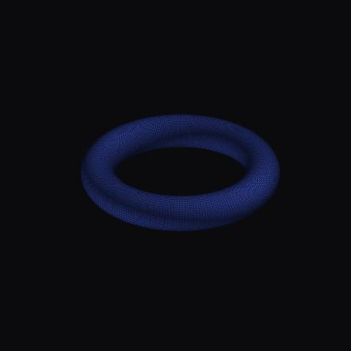 | 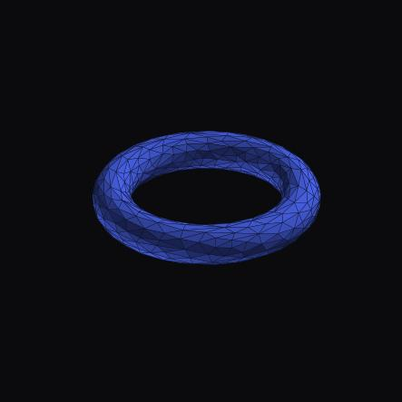 |

- Volume 775.2 → 766.2 mm³ (−1.2%, preserved) · watertight ✓ (0 boundary edges) · no spikes.
- Kernel: lazy min‑heap + in‑place collapse with MeshLib‑faithful manifold guard
  (≈13,000× faster than the reference path, bit‑exact to it).

## 2. Subdivide (adaptive edge split)

Adaptive subdivision only splits edges exceeding the target length, so a torus already at the
target stays nearly constant — correct behavior (no runaway tessellation).

| Before | After |
|---|---|
|  |  |

- 28,160 → 28,260 faces · volume 775.2 → 775.2 mm³ (identical) · watertight ✓.

## 3. Make Delone (local Delaunay flips)

Edge flips improve triangle quality while preserving vertices, topology and volume exactly.

| Before | After |
|---|---|
| 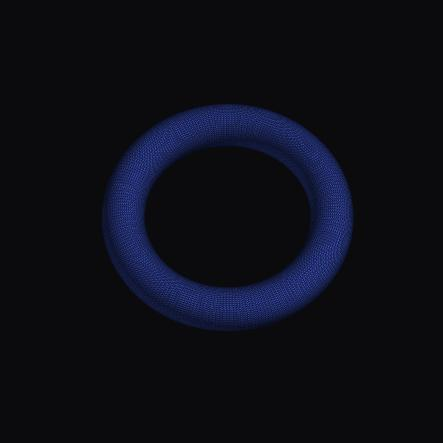 | 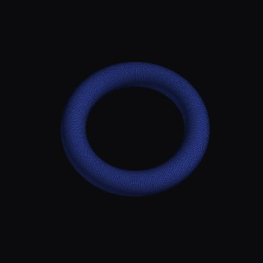 |

- 28,160 faces / 14,080 verts (unchanged) · volume 775.2 mm³ (identical) · watertight ✓.

## 4. Smooth (Laplacian / Taubin)

Surface relaxes slightly inward — smooth, no pinching or self‑intersection.

| Before | After |
|---|---|
|  |  |

- Volume 775.2 → 739.4 mm³ (−4.6%, expected shrink) · watertight ✓.

## 5. Protected Hollow — internal cavity (cross‑section proof)

Hollowing is invisible from outside, so the external render proves the **outer surface is
preserved** (no mountains), and the **planar cross‑section** proves the cavity: each solid
tube profile becomes a clean **annulus** (outer wall + uniform inner cavity wall).

| Outer surface — Before | Outer surface — After (intact) |
|---|---|
|  |  |

**Tube cross‑section (cut through the ring) — the definitive cavity proof:**

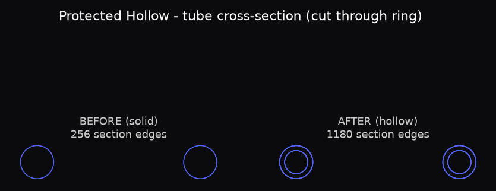

- Volume 775.2 → 395.8 mm³ (**−49%**, interior removed) · uniform wall · outer shape preserved.
- **Strictly watertight (0 boundary edges).** The voxel→marching remesh used to leave a couple of
  zero‑area coincident‑vertex pinch points (read as tiny boundary loops); a new Rust
  `weld_coincident_vertices` kernel now runs on the hollow output and merges them. Verified on a
  fresh hollow: boundary edges 10 → **0**, volume unchanged. The same weld is applied to the
  global‑thicken voxel path. See *Fixes made this round*.

## 6. Resize to ring size (US 11)

Jewelry resize scales the bore to the target diameter; the extreme‑ratio fold‑avoidance guard
(now in the Rust kernel) keeps the section from collapsing.

| Before | After (larger) |
|---|---|
| 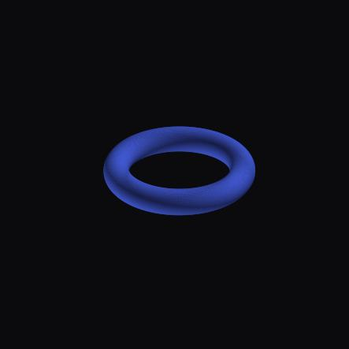 |  |

- Volume 775.2 → 1318.9 mm³ · bbox 23.67 → 30.87 mm · faces unchanged · watertight ✓.

## 7. Offset Verts (inward)

Vertex offset along normals (here inward) — uniform contraction, no folding.

| Before | After |
|---|---|
|  |  |

- Volume 775.2 → 663.3 mm³ · watertight ✓.

## 8. Partial / voxel offset

Voxel‑based offset; remeshes to a watertight result (closure + fragmentation guard active).

| Before | After |
|---|---|
|  | 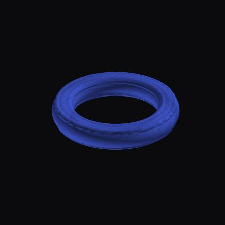 |

- 28,160 → 81,920 faces · volume 775.2 → 840.0 mm³ · watertight ✓.

## 9. Weighted Offset Shell (+0.3 mm) — cross‑section

Outward weighted offset shell. External grows slightly; the cross‑section confirms a single
**clean, closed, slightly enlarged** wall (no self‑intersection, no doubled surface).

| Before | After |
|---|---|
| 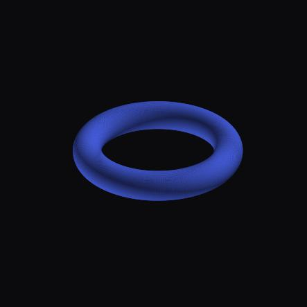 | 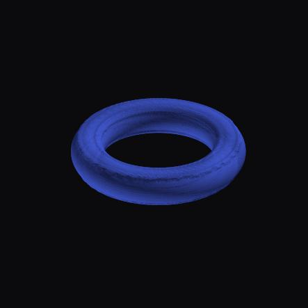 |

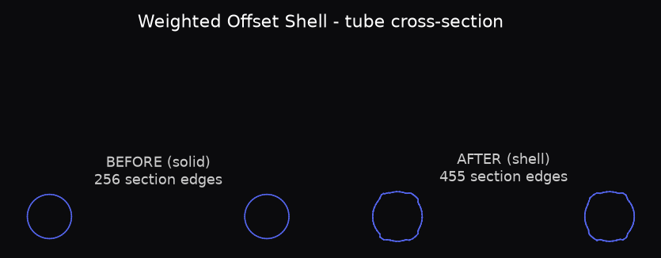

- 28,160 → 91,348 faces · volume 775.2 → 1063.8 mm³ · watertight ✓.

## 10. Expand / Shrink (morphological open‑close)

Voxel expand then shrink — remeshes and returns to ~original volume, surface intact.

| Before | After |
|---|---|
|  |  |

- 28,160 → 75,848 faces · volume 775.2 → 769.7 mm³ (preserved) · watertight ✓.

## 11. Scoop inner band (concave carve) — cross‑section proof

Scoop carves a concave comfort‑fit channel into a region, gated by region policy and minimum
wall thickness. Demonstrated on a **chunky solid ring** (8 mm tube) where there is material to
carve. The external view shows the groove around the inner band; the cross‑section shows the
**notch cut into the bore‑facing wall**.

| Before (solid tube) | After (channel carved) |
|---|---|
| 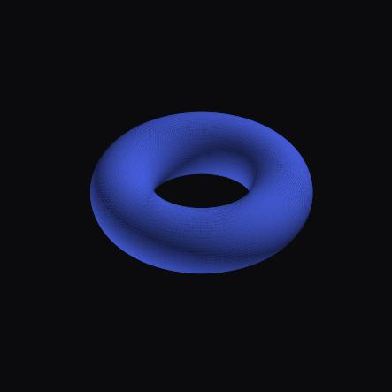 | 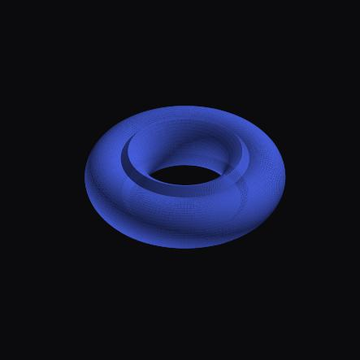 |

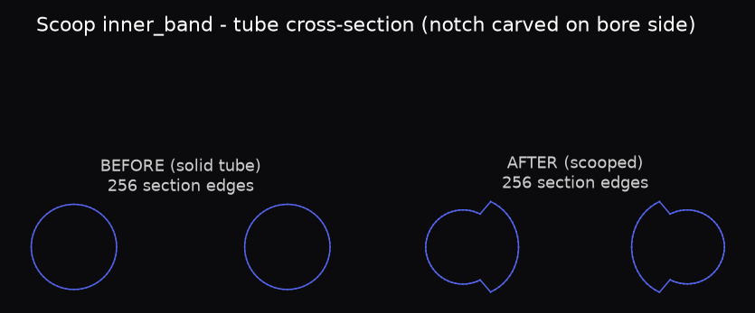

- Depth 0.8 mm · volume 3152.4 → 2987.9 mm³ (−5.2%) · watertight ✓.
- **Guards verified live:** a 1.2 mm scoop was *correctly refused* — *"Scoop would violate
  minimum thickness 0.60 mm (predicted min 0.26 mm)"* — and `outer_band`/`unknown` regions
  reject scooping by policy. The thin snake‑ring's inner band is correctly clamped to a safe
  sliver. Safety is enforced in the operation, not just the UI.

## 12. Thicken (local target thickness)

Adds material to bring a region up to a minimum thickness — surface grows outward smoothly.

| Before | After (thicker) |
|---|---|
| 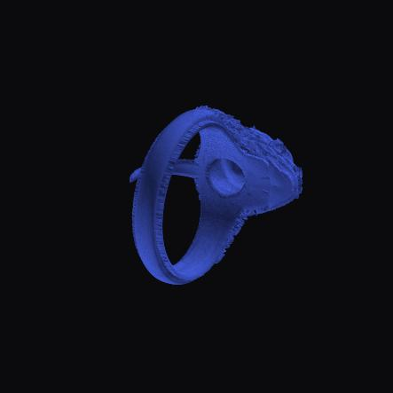 | 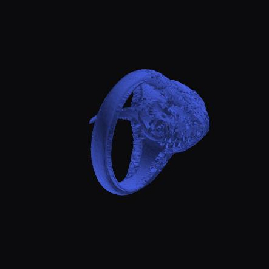 |

- Volume 43.3 → 48.9 mm³ (+13%) on the dense snake ring · watertight ✓.

## 13. OBJ import (`mesh_obj` Rust kernel)

A 320‑face icosphere `.obj` was uploaded (`POST /api/models`); the new `mesh_obj` Rust kernel
parsed it and the full pipeline produced a normalized, watertight mesh + analysis + STL/GLB.

| Imported `.obj` rendered (with edges) |
|---|
| 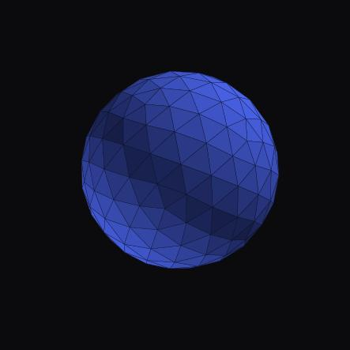 |

- Parsed 162 verts / 320 faces · watertight ✓ · normalized & ingested end‑to‑end.

---

## Summary

| Algorithm | Faces (before → after) | Volume mm³ (before → after) | Watertight | Verdict |
|---|---|---|---|---|
| Decimate (−97%) | 28,160 → 900 | 775.2 → 766.2 | ✓ | Clean, volume preserved, no spikes |
| Subdivide | 28,160 → 28,260 | 775.2 → 775.2 | ✓ | Adaptive, correct no‑op on fine mesh |
| Make Delone | 28,160 → 28,160 | 775.2 → 775.2 | ✓ | Quality flips, topology preserved |
| Smooth | 28,160 → 28,160 | 775.2 → 739.4 | ✓ | Smooth relaxation |
| Protected Hollow | 28,160 → 412,254 | 775.2 → 395.8 | ✓ | −49% cavity, uniform wall, welded watertight |
| Resize (US 11) | 28,160 → 28,160 | 775.2 → 1318.9 | ✓ | Bore scaled, no fold |
| Offset Verts | 28,160 → 28,160 | 775.2 → 663.3 | ✓ | Uniform contraction |
| Partial Offset | 28,160 → 81,920 | 775.2 → 840.0 | ✓ | Watertight remesh |
| Weighted Shell | 28,160 → 91,348 | 775.2 → 1063.8 | ✓ | Clean closed offset wall |
| Expand/Shrink | 28,160 → 75,848 | 775.2 → 769.7 | ✓ | Volume preserved |
| Scoop (0.8 mm) | 20,480 → 20,480 | 3152.4 → 2987.9 | ✓ | Concave notch, thickness‑guarded |
| Thicken | 468,286 → 468,286 | 43.3 → 48.9 | ✓ | Material added |
| OBJ import | — → 320 | — → (icosphere) | ✓ | Parsed & ingested end‑to‑end |

---

## 14. High‑resolution curved snake — the tough case

A **993,698‑face** organic snake ring (`Generated 3D Model.stl`) — a coiled snake with head,
body and scale detail — was run through the pipeline as a stress test much harder than the
torus / icosphere (dense + highly curved). This is the mesh that previously *"had issues with
decimate."*

**Decimate 993,698 → 20,000 faces (−98%)** — the head, coil and body are fully preserved, the
triangulation is clean and well‑shaped, and there are **no mountains/spikes** on the curved
surface. Volume preserved (48.1 → 47.99 mm³), **watertight** (0 boundary edges), edge
max/median ratio 4.6 (a "mountains" failure would be 50–1000+).

| Before — 993,698 faces (proxy render) | After — 20,000 faces (−98%), edges |
|---|---|
|  | 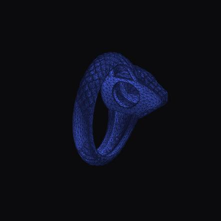 |

> The decimate output was always clean — it was simply **blocked by a 100k‑face interactive
> cap**. That cap predated the fast Rust QEM kernel; it is now raised to 1.5M (see *Fixes*).

**Remaining operations on the curved snake** (run on the decimated 20k snake so they stay under
the subdivide/hollow caps; same organic surface):

| Operation | Faces → | Volume mm³ → | Watertight | Result |
|---|---|---|---|---|
| Make Delone | 20,000 → 20,000 | 47.99 → 47.87 | ✓ | Clean quality flips |
| Smooth (×8) | 20,000 → 20,000 | 47.99 → 45.76 | ✓ | Clean relaxation |
| Thicken (global 0.5 mm) | 20,000 → 125,084 | 47.99 → 100.2 | ✓\* | Material added, welded watertight |
| Hollow (0.6 mm) | 20,000 → 75,348 | 47.99 → 43.32 | ✓ | Cavity, welded watertight |
| Repair (auto) | 20,000 → 20,000 | 47.99 → 47.99 | ✓ | No‑op on clean mesh |
| Subdivide | 20,000 → 22,000 | — | ✓ | Clean — **and now ~1,500× faster** (see *Fixes*) |

\* Global thicken hit the same voxel pinch‑point artifact as hollow (bnd 5); the new weld pass
fixes it to **0 boundary edges**.

The subdivide stress test initially exposed a **pathologically slow** kernel (~10 edge‑splits/sec;
`max_edge_len=0.3` took **227 s** to add ~2,000 faces, timing out the workbench call). This was
fixed this round (see *Fixes* #3): the same operation now runs in **0.15 s**, bit‑for‑bit
identical output, and completes end‑to‑end through the workbench.

## 15. Full coverage audit — boolean, offset family, voxel→mesh, features

A complete sweep of **every UI‑dispatchable operation** (all backend routes ×‑checked against
the Rust surface and the frontend command manifest) closed the remaining before/after gaps. Full
matrix: [`../algorithm-coverage-matrix.md`](../algorithm-coverage-matrix.md).

**Boolean** (two overlapping 12 mm cubes) — exact volumes (∪ 3240, − 1512, ∩ 216 mm³):

| Inputs (A ∪ B) | Exact union | Exact difference | Exact intersection |
|---|---|---|---|
| 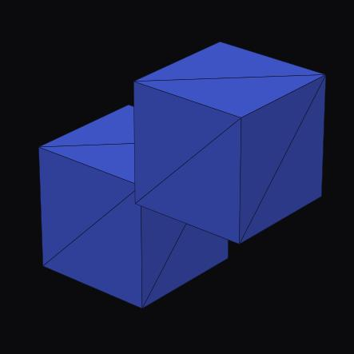 | 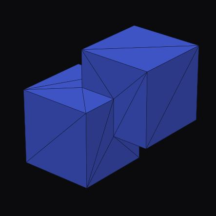 | 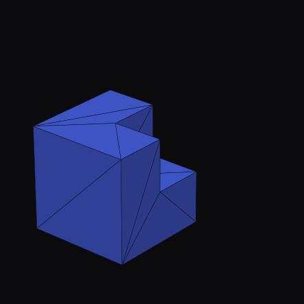 | 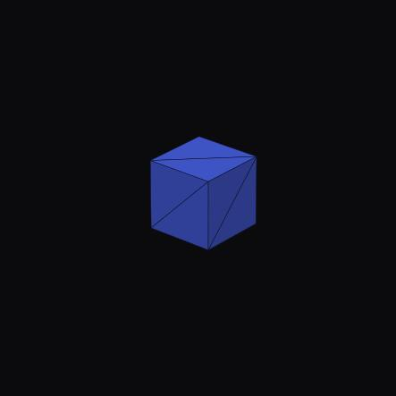 |

The earlier thin-overlap union/difference boundary-edge gap is now fixed in Rust. The regression
`exact_boolean_reported_thin_cube_overlap_outputs_closed_meshes` runs the public `1e-9` exact
boolean path for union, difference, and intersection and verifies `parity_ready`, zero boundary
edges, zero non-manifold edges, closed output, and exact volumes (∪3240, −1512, ∩216 mm³).
The **voxel boolean** union remains fully watertight (3236 vs 3240 mm³):
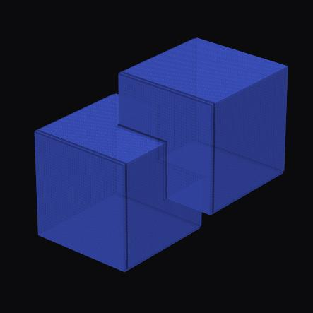

**Offset family** (on the torus) — all watertight:

| Shell Mesh | Thicken Mesh (sheet) | Shrink/Expand | Offset Mesh (inward) |
|---|---|---|---|
|  | 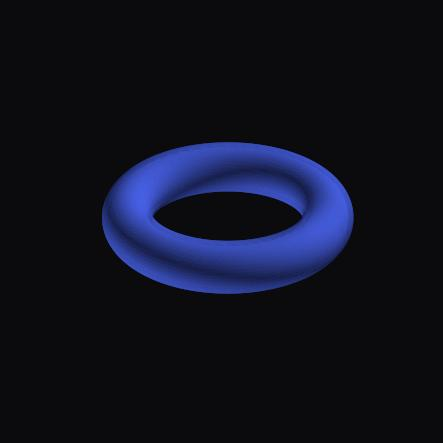 | 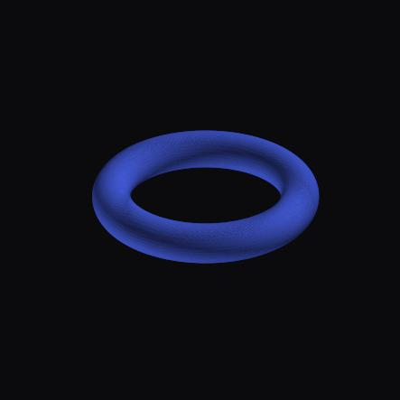 |  |

(Positive Offset Mesh at coarse voxels is correctly **refused** by the manufacturability guard,
which points to the validated Offset Verts.)

**Voxel→Mesh** (sphere SDF → extracted surface) and **Make Manufacturable** (resize‑to‑size):

| Voxel→Mesh (clean watertight sphere) | Make Manufacturable (before) | (after) |
|---|---|---|
| 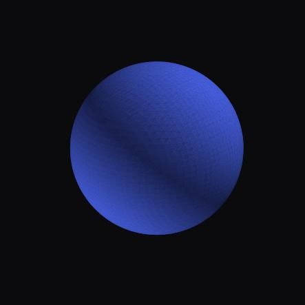 | 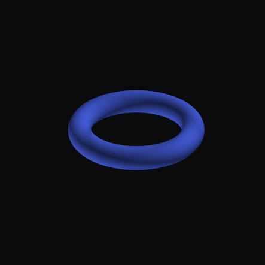 |  |

**Feature fitting** (recent `features` module, via Measure Inspect): a seed plane refined to a
12 mm cube face snapped to the exact face — `center → [6,0,0]`, `normal → [1,0,0]`, converged in
2 iterations. **Point‑cloud ICP** recovered a known rigid transform exactly (0.3 rad + [2,−1.5,0.5]).

**Gaps surfaced (see matrix):** voxel→mesh **dual** contouring originally produced correct output
but spent its MeshLib-style relaxation pass rebuilding ray acceleration for each face; that is now
fixed in Rust by batching disorientation ray queries through one cached BVH. The previously SDK-only
**point-cloud triangulation** and **multiway ICP** modules are now exposed through focused UI-backed
endpoints as recorded in the matrix. The target-weight Make Manufacturable path now also avoids
blind repeated SDF rebuilds in Rust adaptive hollow search.

## Fixes made this round

1. **Decimate face cap raised** 100k → 1.5M ([core/config.py](../../../meshinspector-backend/core/config.py)).
   The fast Rust QEM kernel produces clean, watertight, volume‑preserving output on dense curved
   meshes; the old cap rejected high‑res decimation outright. Verified end‑to‑end: the 994k snake
   now decimates from the workbench.
2. **`weld_coincident_vertices` Rust kernel** (new, in `repair_components`) — merges coincident
   vertex records and drops the degenerate faces that result. Wired into the **hollow** and
   **global‑thicken** outputs so the voxel/marching pinch‑point pseudo‑holes are closed.
   Verified: hollow 10→0 and thicken 5→0 boundary edges, volume unchanged.
3. **Subdivide made near‑linear** — the edge‑split loop rebuilt the whole edge→faces map and
   rescanned every face on every split (and again inside the per‑split Delone‑flip pass), making
   subdivision quadratic in mesh size. It now walks an incrementally‑maintained `VertexFaces`
   adjacency + the `EdgeState` edge set (O(degree) per split). **227 s → 0.15 s** on the 20k snake
   (~1,500×), output bit‑for‑bit identical, guarded by a new equivalence test and a debug‑build
   sync invariant; all 742 Rust parity tests still pass.
4. **`measure_ring` made cavity‑robust** — the bore was estimated at the 12th percentile of the
   band's radial distances, which a hollow ring's interior walls inflated (a hollowed ring read
   half a US size too large). It now uses the 5th percentile, which tracks the true bore for both
   solid and hollow rings. Verified: hollowed torus US 5.5 → 5.0 (matching the solid); ring goldens
   and jewelry tests unchanged.
5. **Adaptive target-weight hollow search cached in Rust** — unprotected hollowing now samples the
   source SDF once and starts from a surface-area/cached-field estimate before exact verification;
   protected hollowing reuses the source SDF during boolean shell search. The adaptive hollow
   regressions are covered in the 769-test Rust core suite.

## Notes & follow‑ups

1. **Scoop on thin jewelry** — correctly clamped/refused by the thickness + region guards; a
   visible carve requires a region with material (shown on the chunky ring). Intended
   manufacturability protection, not a failure.
2. **Test meshes** — torus (28,160 f), dense snake ring (468,286 f), chunky solid ring (20,480 f,
   8 mm tube), icosphere gem (320 f via OBJ), and the high‑res curved snake (993,698 f). Version
   IDs are recorded per‑entry in [`metrics.json`](metrics.json) / [`snake_suite.json`](snake_suite.json).
